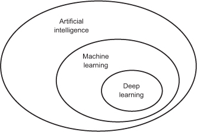
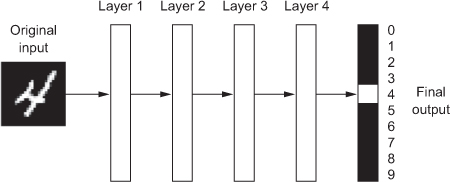
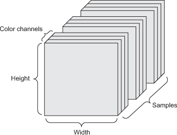
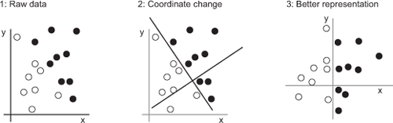
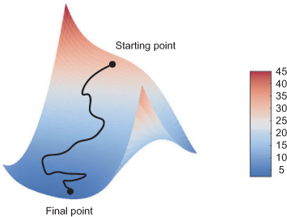

# Intro to Deep Learning

## Summary

Today you will get an intro to deep learning. You will see that getting started is *accessible* and you don't have to know everything to get started. You can get airborn pretty quickly!

We will explore the data encoding, train, run, and evaluate neural networks in Python using Keras.

In classical programming, answers are the product of input data and the explicit rules that programmers manually program.

In *machine learning*, input data and example answers yield the rules we can use on future inputs. The output is a function of the inputs. Deep learning attempts to approximate that applied function.

Deep learning answers the same questions as ML (classification, clustering, regressions, anomaly detection, what should we do next?) and can work with both labeled and unlabeled data.

### What is Deep Learning? 

Applied linear algebra and calculus w/ the latest in hardware. Yay, math!

The "deep" refers to the number of layers of data transformation used to sift for meaningful representations. Imagine a chain of logisic regressions feeding into eachother. 

Deep learning is the application of many different representations of data to identify meaningful relationships in data. Explore high dimensional representations of the data. 

The key component of deep learning sending representation results through an optimizer that updates weights and runs the inputs with the updated weights. 

### What Deep Learning is *not*

- Cognition or thinking or inaccessible mathematics. Nor is it generalized.
- Always better or always worse than classical machine learning. "It depends"
- Free from bias and prejudice. (Biased inputs mean biased outputs) 

### Bias in = bias out, garbage in, garbage out

- As an example, researchers trained a Convolutional Neural Network (CNN) pictures of skin cancer patients with patients experiencing another kind of lesion. Each image was labeled "non-cancerous" or "cancerous". The model was **very** accurate on the training data. With test data and real pictures, the model produced a *profound* amount of false negatives. It turns out that > 90% of the the "cancerous" labeled images for training had a ruler in the image, for scale. So the model "learned" to associate rulers in the picture with a positive cancer prediction.
- In another example, researchers building criminality prediction algorithm trained a neural network with labeled pictures. The criminal pictures were mug shots from convicts. For the "non-criminal" images, researchers used a set of royalty-free images of fashion models. Imagine the results! The more someone looks like a model, the less likely the criminality! 
- Incentivized, ignorant, and malicious actors can claim "the data doesn't lie". They can wash their hands claiming "science" and "computer algorithms". No incentive to question assumptions or methods.
- Takeaway: *many* problems need the model to be interpretable. Things like health insurance, loan approval, predictive policing, 
- It's our ethical duty to shine the light, to work to make things better not worse. 

### Vocabulary

- **Tensor**: a basic data structure holding n dimensional matrices, usually numerical data
- **Scalar**: A tensor that holds only one number (a zero dimensional tensor)
- **Vector**: A one dimensional array of numbers (a one dimensional tensor)
- **Matrices**: An array of vectors. (a two dimensional tensor)

### Real World Tensor Data

- Vector data —2D tensors (samples, **features**)
- Time series data or sequence data are 3D tensors of shape (samples, time-steps,
  **features**)
- Images—4D tensors of shape(samples,height,width,channels)or(samples,
  channels, height, width)
- Video —5D tensors of shape (samples, frames, height, width, channels) or
  (samples, frames, channels, height, width)

### Image data tensors - 4 dimensional tensors

Each image usually has 3 dimensions: height, width, and color-channels (sometimes grayscale)

The 4th dimension is the set of all samples.

### Identify meaningful representations of the data

This figure shows the original data and a new representation. We obtain new representations of the data by changing our axes to fit the story the data tells. Here we get a new representation of the data in such a way that we can describe data with a simple rule:

> “Black points are such that x > 0,” or “White points are such that x < 0.”

&nbsp;&nbsp;&nbsp;&nbsp;&nbsp;&nbsp;&nbsp;&nbsp;&nbsp;&nbsp;&nbsp;&nbsp;&nbsp;&nbsp;&nbsp;&nbsp;&nbsp;&nbsp;&nbsp;&nbsp;&nbsp;&nbsp;&nbsp;

Geometric transformations in high dimensional space. "Uncrumpling paper balls is what machine learning is about: finding neat representations for complex, highly folded data manifolds. Each layer in a deep network applies a transformation that disentangles the data a little" - Chollet

## Anatomy of a Deep Learning Network

- In deep learning, we perform many data representations and transformations to compare predictions vs. true targets. The accuracy of the prediction is fed into an optimizer, and the optimizer updates the weights on different layers or features. Then, we run the data through the same layers with updated weights.
- This is the "learning" process: the feeding back of the result of predictions (backpropogation) through an optimization function that updates weights on layers that run on the data again, making for more effective predictions.
- Each layer is the application of many geometric transformations of the tensor data

### Backpropogation is how the network "learns"

With our `optimizer`, training happens within what’s called a *training loop*, which works as follows. Repeat these steps in a loop, as long as necessary:

1. Draw a batch of training samples `x` and corresponding targets `y`.
2. Run the network on `x` to obtain predictions `y_pred`.
3. Compute the loss of the network on the batch, a measure of the mismatch between `y_pred` and `y`.
4. Compute the gradient of the loss with regard to the network’s parameters (a *backward pass*).
5. Move the parameters a little in the opposite direction from the gradient—for example `W = step * gradient`—thus reducing the loss on the batch a bit.

### Stochastic Gradient Descent 

### Why and when to use neural networks vs. classical ML

- When we have tremendous amounts of data
- When we have rich, perceptual data such as images, audio, or video
- When we want automated feature engineering, but remember the curse of dimensionality!
- When we have the resources and time

### Why and when to use classical ML over neural networks

- Works better on small data

- Financially and computationally cheap

- Easier to interpret

### Further resources
- [MNIST Convolutional Deep Dive on Google Colab](https://codelabs.developers.google.com/codelabs/cloud-tensorflow-mnist/#0) by Martin Gorner

#### Video Course Recommendations

- Recommend `https://www.lynda.com/Google-TensorFlow-tutorials/Building-Deep-Learning-Applications-Keras-2-0/601801-2.html` 
- `https://www.fast.ai/`for deeper practice with deep learning. 
- MIT's Linear Algebra `http://web.mit.edu/18.06/www/videos.shtml`
- If you're a Bexar County resident, get your library card from `https://bexarbibliotech.org/` to get free access to `lynda.com`, a massive library of high quality video courses for professionals.

#### Selected readings

- *Deep Learning With Python* by Francois Chollet (first 3 chapters are free) `https://livebook.manning.com/#!/book/deep-learning-with-python/about-this-book/`

- `https://static.googleusercontent.com/media/research.google.com/en//pubs/archive/35179.pdf`  to answer the question, "what model should I use?"